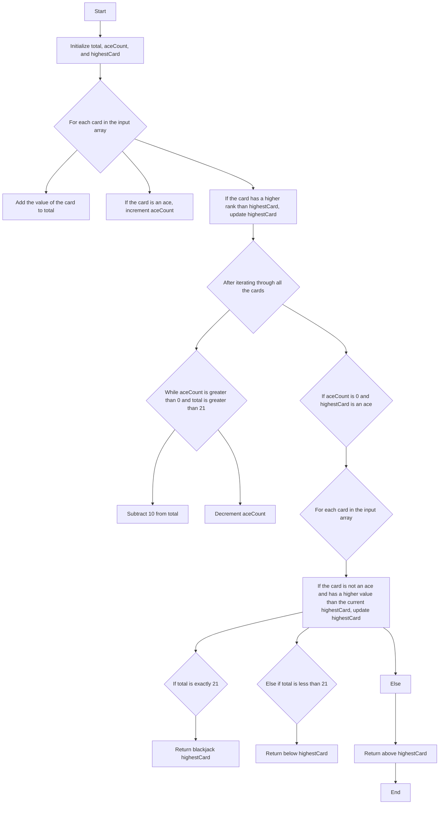

# BlackjackHighest

## <b>Solution overview</B>

```mermaid
graph TD 
    A[Start] --> B[Initialize total, aceCount, and highestCard] 
    B --> C{For each card in the input array} 
    C --> D[Add the value of the card to total] 
    C --> E[If the card is an ace, increment aceCount] 
    C --> F[If the card has a higher rank than highestCard, update highestCard] 
    F --> G{After iterating through all the cards} 
    G --> H{While aceCount is greater than 0 and total is greater than 21} 
    H --> I[Subtract 10 from total] 
    H --> J[Decrement aceCount] 
    G --> K{If aceCount is 0 and highestCard is an ace} 
    K --> L{For each card in the input array} 
    L --> M[If the card is not an ace and has a higher value than the current highestCard, update highestCard] 
    M --> N{If total is exactly 21} 
    N --> O[Return blackjack highestCard] 
    M --> P{Else if total is less than 21} 
    P --> Q[Return below highestCard] 
    M --> R[Else]
    R --> S[Return above highestCard] 
    S --> T[End]
```